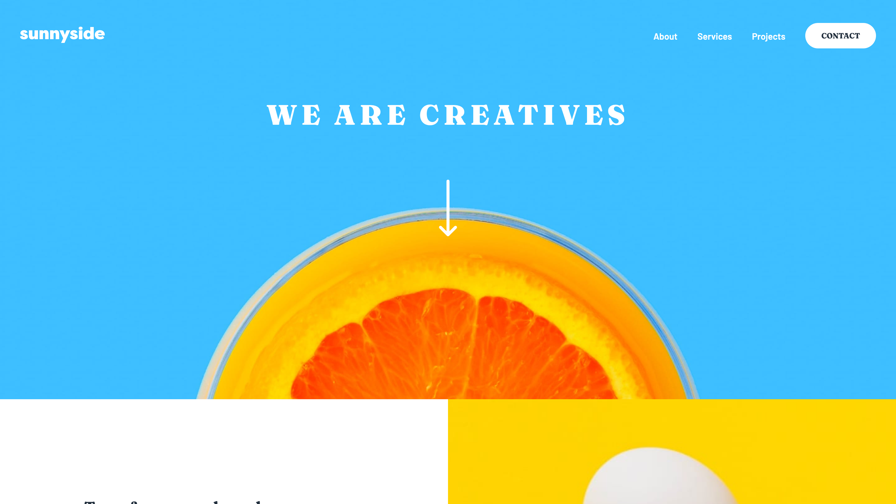

# Frontend Mentor - Sunnyside agency landing page solution

This is a solution to the [Sunnyside agency landing page challenge on Frontend Mentor](https://www.frontendmentor.io/challenges/sunnyside-agency-landing-page-7yVs3B6ef). Frontend Mentor challenges help you improve your coding skills by building realistic projects.

## Table of contents

- [Overview](#overview)
  - [The challenge](#the-challenge)
  - [Screenshot](#screenshot)
  - [Links](#links)
- [My process](#my-process)
  - [Built with](#built-with)
  - [What I learned](#what-i-learned)
  - [Continued development](#continued-development)
- [Author](#author)
- [Acknowledgments](#acknowledgments)

## Overview

### The challenge

Users should be able to:

- View the optimal layout for the site depending on their device's screen size
- See hover states for all interactive elements on the page

### Screenshot

### Links

- Solution URL: [Solution URL](https://github.com/Cinquantesix/sunnyside-agency-landing-page)
- Live Site URL: [Live site URL](https://jocular-kringle-687c90.netlify.app/)

## My process

I tried to focus on the mobile-first and developp desktop after. I think it's really challenging because you need to know how each part of the design will fit in a bigger screen. Like chest, you need to have some step ahead. I think I miss that part for now. But when the mobile code is set, the desktop code is really quick to set-up and it's really cool to lose less time on this part!

### Built with

- Semantic HTML5 markup
- CSS custom properties
- Flexbox
- CSS Grid
- Mobile-first workflow

### What I learned

- Doing a bigger project with content that influence others
- Use SCSS in a better way
- Importance of 7:1 (I don't use in the projet and I regret it…)
- Use less HTML and more CSS
### Continued development

Next time I will:

- Maybe use 7:1, I think bigger project need to be more clear
- Begin to add comment in my code (seriously…)
- Find a way to declare BEM with good terms
- Develop more each part one after all with all style (mobile + desktop) and less all the site in mobile and after in desktop
- Find a better way to have smooth content between screen size

## Author

- Frontend Mentor - [@Cinquantesix](https://www.frontendmentor.io/profile/Cinquantesix)
- Codepen - [@cinquantesix](https://codepen.io/cinquantesix)

## Acknowledgments

Thanks [@gmagnenat](https://www.frontendmentor.io/profile/gmagnenat) for his help and good advice.
